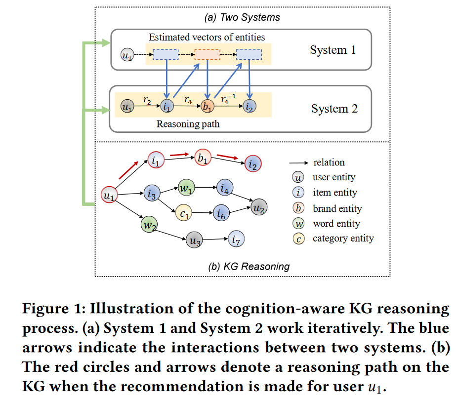
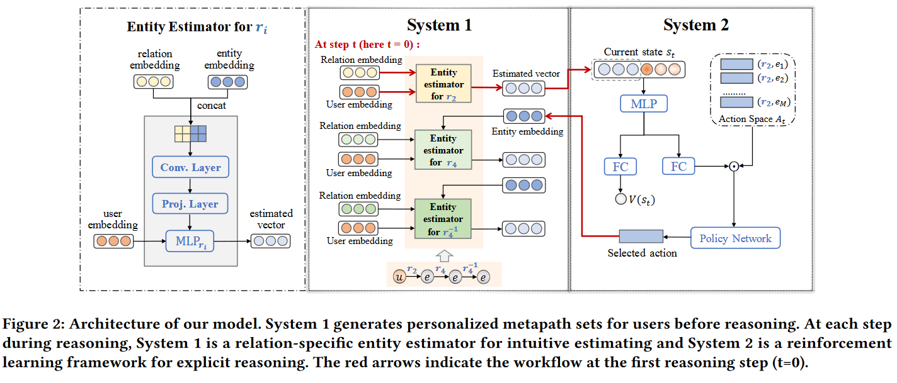

**Cognition-aware Knowledge Graph Reasoning for Explainable Recommendation**

# 简介
&emsp;&emsp;知识图谱（KG）已被广泛应用于推荐系统，以有效提高推荐的准确性和可解释性。最近的研究通常赋予知识图谱推理功能，以寻找多跳用户-物品连接路径来解释物品被推荐的原因。现有的路径寻找过程是由逻辑驱动的推理算法设计的，而算法和用户对推理过程的感知存在差距。事实上，人类思维是一种自然的推理过程，它能对特定决策的原因做出更恰当、更有说服力的解释。受认知科学中的双重过程理论（Dual Process Theory）的启发，本文提出了一种认知感知的可解释推荐 KG 推理模型 CogER，它模仿人类的认知过程，设计了两个模块，即系统 1（进行直觉判断）和系统 2（进行显式推理），以生成实际的决策过程。在认知感知推理过程中的每一步，系统 1 都会根据用户的历史行为生成对下一步实体的直观估计，而系统 2 则会进行显式推理并选择最有前途的知识实体。这两个模块迭代工作，相辅相成，使本文的模型能够产生高质量的推荐和正确的推理路径。在三个真实世界数据集上的实验表明，与以前的方法相比，本文的模型通过解释获得了更好的推荐结果。

# 研究动机
&emsp;&emsp;为了解决可解释推荐问题，人们应用了包含全面结构知识的知识图谱（KG）。这些知识感知的可解释模型通常会在知识图谱上找到多跳路径，作为推荐项目的解释。以图 1（b）为例，在知识图谱中，用户 u1 购买了品牌为 b1 的商品 i1，同一品牌 b1 下还有另一个商品 i2。根据它们在知识图谱中的联系，可以向用户 u1 推荐商品 i2，并解释说 "用户可以购买与之前购买的商品品牌相同的商品"。上述过程被广泛称为 KG 推理 。推理路径 u1→i1→b1→i2 由 KG 推理过程的每一步组成，因此可以作为推荐商品 i2 的解释。用于推荐的 KG 推理方法不仅能获得高质量的推荐结果，还能生成相应的解释。这些方法可分为基于嵌入的方法和基于路径的方法，前者采用 KG 嵌入进行推荐，后者将 KG 的结构信息纳入寻路过程。然而，上述方法都是逻辑驱动算法，与实际的人类推理存在差异。
# 相关工作    
## Knowledge Graph-based Recommendation
&emsp;&emsp;基于知识图谱的推荐方法可分为基于嵌入的方法和基于路径的方法。基于嵌入的方法在推荐任务中使用 KG 嵌入。一些研究捕捉 KG 中的丰富信息，并使用潜在向量来描述 KG 实体和关系。这些方法将 KG 作为侧面信息引入，有效缓解了推荐中的冷启动和数据稀疏问题。但是，这些方法没有利用 KG 的结构信息，无法解释某些项目被推荐的原因 。为了解决这个问题，一些研究人员尝试利用 KG 的连接结构来完善实体的表示。这些方法都涉及嵌入传播过程，可以将其视为对 KG 的推理过程，从而作为推荐的解释。相比之下，基于路径的方法利用 KG 的关系结构，为用户提供可解释的推荐。它们利用 KG 推理生成推理路径，包括推理过程中每一步所做的决定。这些推理路径可以作为推荐的解释
## Cognitive Science in AI
提高人工智能系统的可解释性和可靠性是未来几年人工智能发展的趋势。由于人工智能是对人类智能的模仿，脑科学和认知科学的理论已被纳入人工智能系统的设计和开发中。例如，Ding 等人受到认知科学中双重过程理论的启发，提出了多跳问题解答（QA）任务的双系统框架。Du 等人提出了用于单次 KG 推理的认知模型 cogKR。在本文中，由于不同任务场景的特点，本文不把这些模型作为基准
