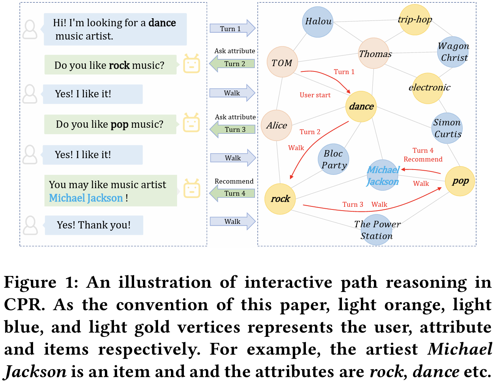
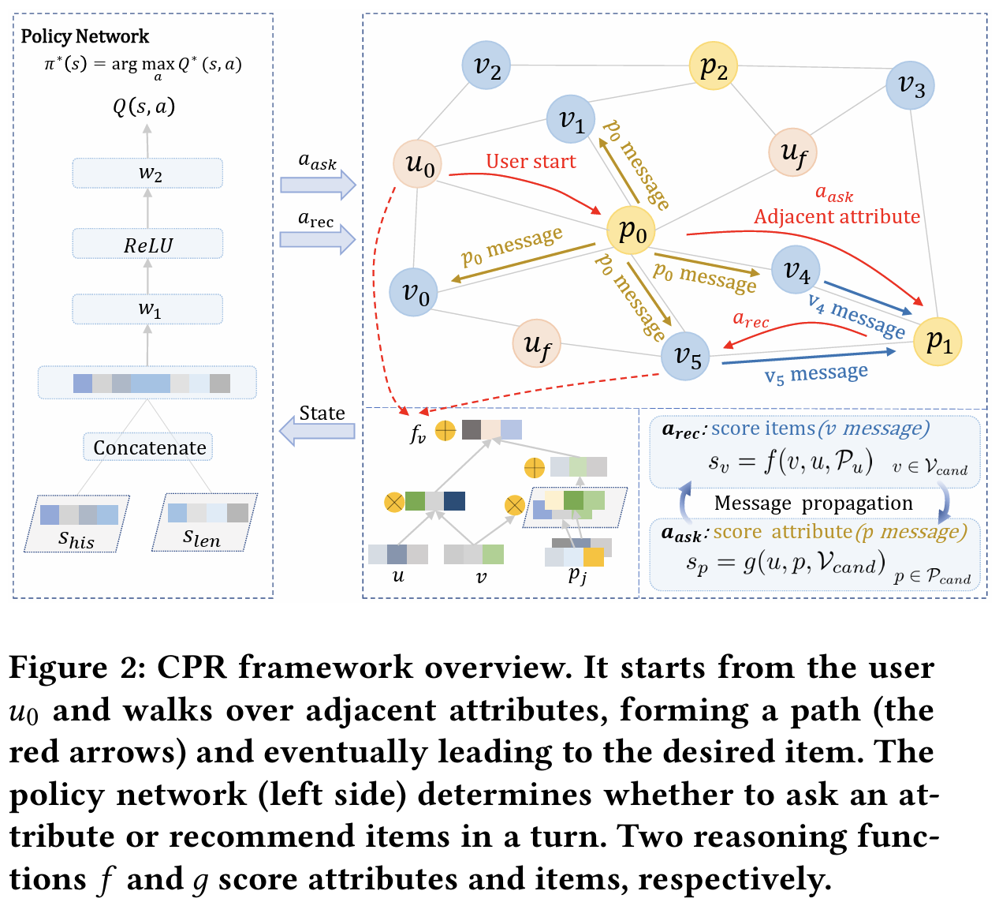
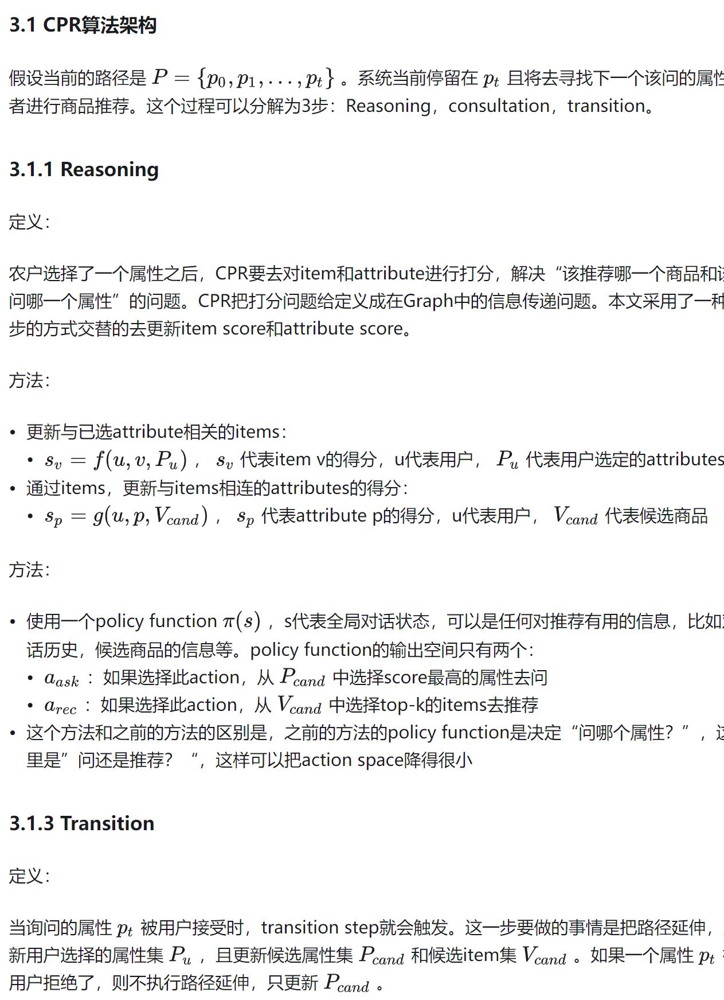

**Interactive Path Reasoning on Graph for Conversational Recommendation**

# 1. 简介
&emsp;&emsp;推荐系统 (recommender system)：指的是从用户过去的购买习惯中学习用户的兴趣，从而给用户推荐合适的商品，是一个单轮交互的过。
&emsp;&emsp;任务型对话系统 (task-oriented dialogue system)：通过多轮对话，在会话过程中，捕捉用户的兴趣等，完成一个特定的任务，是一个多轮交互的过程。
&emsp;&emsp;对话推荐系统 (conversational recommender system, CRS)：由于推荐系统更多的是去关注用户过去的偏好，但是用户当前的兴趣可能已经改变。而对话系统更多的是关注当前session的用户兴趣，而不太关注用户历史的兴趣，所以这样做出来的推荐可能会偏离用户长期的购买习惯。所以在用户决策的过程中，历史信息与当前的信息都很重要，结合这两点因素，就提出了对话推荐系统，在对话推荐系统中，系统与用户将发生多轮对话，系统结合用户的历史兴趣，以及当前对话中捕捉到的用户兴趣，对用户进行商品推荐。
本文主要处理的是multi-round conversational recommendation场景。

round：一次推荐尝试
multi-round：可以多次问问题，多次推荐，直到推荐对了，才结束。
对话推荐系统的核心是怎么去“问”以及怎么去“推荐”。推荐的目标是尽可能推荐的准，问的目标是希望能够在最短的轮次中就定位到用户想要的商品，并成功推荐。完成这样一个任务大致的pipeline如下。

pipeline

每一个对话session从用户侧开始，用户侧有一个初始的属性集 
CRS会询问用户对于某一个属性的喜好（从候选属性集中选取）或者直接推荐商品（从候选商品集中选）。此时用户会有一下几种可能
如果出的是商品，且用户接受了该商品，session结束
如果出的是商品，且用户拒绝了该商品，则CRS把这个商品从候选商品集中移除
如果出的是属性，且用户接受了该属性，则CRS把这个属性放进用户已选择的属性集中去，并把其从候选商品集中除去。之后更新 
如果出的是属性，且用户拒绝了该属性，则CRS把这个属性从候选商品集移除
直到用户接受了CRS推荐的商品，则整个session结束。
# 2.研究动机
&emsp;&emsp;CRS这个任务之前的几篇paper主要是使用强化学习的方式去决定每一个时刻的action，作者认为这样的方式的可解释性相对不足
&emsp;&emsp;作者认为，更显式的利用属性偏好信息，对推荐的准确性和可解释性都是更有帮助的
&emsp;&emsp;在这篇文章中，作者把CRS任务建模成在user-item-attribute graph中的路径推理问题，引入图结构，利用更多的信息。并且在这套框架中，推荐系统和对话系统是相互促进的。一方面，路径推理为对话系统提供了更自然的DST，使得对话选择从逻辑上更加完善；另一方面，可以直接从用户反馈中获得属性，使得搜索空间大大减小。
下面用一个例子展示一下CRS任务是如何被建模成路径推理问题的。

用户“TOM”进入对话，带着一个初始属性“dance”，所以第一步就是从“TOM” -> “dance”
系统进行邻接属性的搜索，对于“dance”的邻接节点进行搜索，选择了询问“rock”， 且用户接受了，所以第二步从“dance” -> “rock”
系统再进行搜索，在“rock”和“dance”的邻接节点中进行搜索，选择了询问“pop”，且用户接受了，所以第三步从“rock” -> “pop”
此时系统已经收集到了足够多的信息了，通过“dance”，“rock”，“pop”三个节点，选择了“Michael Jackson”这个节点进行推荐，且用户接受，此时session结束。
3. Model

