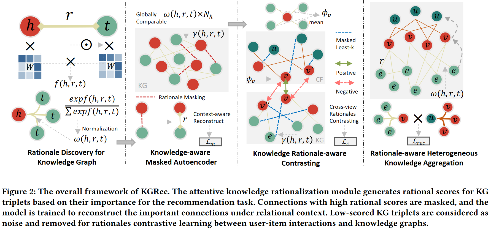

# 一、简介
&emsp;&emsp;知识图谱(Knowledge Graphs, KGs)被广泛用于推荐系统来提升模型对于冷启动商品的表现。然而通过分析已有模型,作者发现在大量的知识图谱关系中,仅有一小部分在预测推荐列表时起到了重要作用,即知识三元组的重要性构成了典型的长尾分布。因此,本文提出了KGRec模型,从协同过滤信号中学习知识图谱中重要的知识结构(rationales),并且统一生成式(generative)和对比式(contrastive)的自监督学习来促进rationales的产生、显试地强调这些rationales,并且抑制噪声知识,以进一步提升推荐模型性能
论文出处: https://doi.org/10.1145/3580305.3599400
源址:https://cg-blog.com.cn/posts/KGRec.html
## 1.1 研究背景
&emsp;&emsp;协同过滤在广泛的应用中非常有效,并推动了推荐系统领域的重大进展。近年来,随着神经网络和用户与项目的潜在嵌入的引入,协同过滤(CF)框架得到了显著的改进,从而有效地增强了传统的矩阵因式分解方法。此外,整合了变异自动编码器、注意力机制和图神经网络的新型模型也进一步提高了CF的性能。
&emsp;&emsp;研究者们对于知识图谱增强的推荐推荐系统的探索始于基于embedding的方法和基于路径的方法。具体而言,一些研究(CKE,KTUP)将基于Transition建模的知识图谱embedding(例如TransR和TransE)融入商品embedding中,以丰富用户和商品的建模。另一些研究专注于从知识图谱中提取具有丰富语义的元路径,并沿着这些元路径对用户和商品进行基于路径的建模。为了汲取这两种方法的优点,统一基于embedding和基于路径的方法,最近的研究采用了强大的图神经网络(GNNs),通过在知识图谱上进行传播和聚合来捕获多跳高阶信息。这些最先进的基线模型包括(KGAT, KGIN [1])。
## 1.2 提出问题(研究目的)
&emsp;&emsp;①：用户-物品交互的稀缺性从根本上限制了性能提升的范围。
&emsp;&emsp;②：知识图谱已被证明能有效改善推荐系统,但它们也会引入噪声和稀疏性问题,导致性能不达标
&emsp;&emsp;③：实现准确有效的基于知识图谱的推荐,对用户偏好学习背后的理由进行明确建模,提高推荐的可解释性
## 1.3 解决方法
&emsp;&emsp;提出使用对比学习(CL)来实现更好的知识感知推荐。例如,KGCL将随机图增强应用于知识库,并通过 CL 解决知识库中的噪声实体和长尾问题。
&emsp;&emsp;提出了一种新的知识图谱增强型推荐系统,称为 KGRec,利用细心的知识合理化为知识三元组生成与任务相关的合理分数。KGRec 提出了一种自监督合理性感知屏蔽机制,通过自适应屏蔽具有较高合理性得分的知识三元组,从知识图谱中提取有用的合理性。通过强迫 KGRec 学习重建这些重要的联系,作者突出了与任务相关的知识原理。此外,作者还通过知识感知对比机制来调整 KG 信号和协同过滤(CF)信号之间的合理语义。为此,作者在图增强过程中通过掩码过滤掉了可能成为潜在噪音的低分知识,从而实现了对比学习。最后,作者将合理分数注入推荐任务的知识聚合中,使知识合理分数能够从 CF 标签中紧密学习。
具体实现：
&emsp;&emsp;① 为知识图谱增强型推荐系统统一了生成式和对比式自我监督学习,从而能够在知识图谱中提炼出有用的知识关联,并以无噪声和理性感知的方式将其排列在一起进行推荐。
&emsp;&emsp;② 提出的合理性感知屏蔽机制使作者能够识别并突出知识图谱中最重要和最相关的信息,同时抑制潜在的噪音或不相关的知识图谱连接。
&emsp;&emsp;③ 为了验证模型 KGRec 的有效性,在三个真实的数据集上进行了广泛的实验。
# 二、模型方法

## 2.1 知识图谱的基本发现(Rationale Discovery for KG)
&emsp;&emsp;为了从复杂的知识图谱中自动提炼出推荐所需的基本语义,作者提出了一种加权函数,用于学习知识三元组成为协作互动基本原理的概率。该加权函数基于可学习的图注意机制对每个知识三元组进行加权。
$$ f(h, r, t)=\frac{e_hW^Q\cdot(e_tW^K \odot e_r)^T}{\sqrt{d}}$$
&emsp;&emsp;知识三元组的合理性得分 $f(h, r, t)$ 表示其在帮助用户偏好方面的重要性,这是由模型学习并由推荐任务中的标签所引导的。为确保同一头部实体的邻居之间的合理性得分具有可比性,作者使用以下 $softmax$ 函数按邻居数量 $N_h$ 对得分进行归一化处理：
## 2.2 知识感知屏蔽自动编码器(Knowledge-aware Masked Autoencoder)
&emsp;&emsp;知识图谱中实体之间嘈杂或不相关的连接会导致次优的表征学习。这一问题在知识感知推荐系统中尤为严重,因为在该系统中,用户和项目表征会进一步受到知识图谱噪声的干扰,导致推荐结果不准确。为了消除 KG 中的噪声效应,提炼出有利于推荐任务的信息信号,作者建议突出具有高合理性得分的重要知识三元组,最近关于遮蔽式自动编码器的研究已经证明了这种方法的有效性,它可以在重建缺失知识的过程中遮蔽重要信息,从而使模型获得有用的隐含语义。在这些研究成果的基础上,作者设计了一种遵循 "屏蔽-重建"(masking-and-re-constructing)方法的生成式自我监督学习任务。在每个训练步骤中,都会掩盖 KG 中的一批知识三元组,并根据生成式自我监督目标重建这些关系边缘。此外,为了确保被屏蔽的三元组具有全局性的高合理性得分,这意味着屏蔽了对推荐任务非常重要的知识,并迫使模型学习重建这些连接,以突出编码用户偏好的有用知识。
&emsp;&emsp;模型中的知识图谱训练模块会根据 KG 三元组对推荐任务的重要性为其生成合理分值。高合理分值的连接会被屏蔽，然后对模型进行训练，以便在关系上下文中重建重要的连接。得分低的 KG 三连节点被视为噪音，并被移除，以便在用户-项目交互和知识图谱之间进行合理性对比学习。
## 2.3 知识基础感知对比(Knowledge Rationale-aware Contrasting)
&emsp;&emsp;如前所述，知识三元组的分层合理性来自知识图谱与用户参与推荐标签之间的联系。为了进一步提高知识合理化模块的可解释性，作者从以前的工作中汲取了灵感[52]。具体来说，作者建议将知识图谱的表征与协同过滤信号相一致，这样就可以明确地建立跨视图合理性模型。为了构建去偏的对比视图，作者首先要识别并移除可能在两个图中都引入噪音的弱任务相关边。关于知识图谱，值得注意的是，理由得分较低的知识三元组往往对推荐任务的影响较小。因此，作者的目标是通过删除有噪声的三元组来提高图的质量。这一增强过程可确保剩余的三元组信息量更大，合理性得分更高。这样，作者就能提高模型的性能，更好地捕捉图中实体之间的潜在关系。

$$\mathcal{S}_{k}=\left\{(h, r, t) \mid \gamma(h, r, t) \in \operatorname{topk}\left(-\Gamma ; \rho_{k}\right)\right\}  $$

$$\mathcal{G}_{k}^{c}=\mathcal{G}_{k} \backslash \mathcal{S}_{k}$$

&emsp;&emsp;作者引入了知识强度评分 $γ$ 和 $Γ$，它们是通过添加 Gumbel 噪声计算得出的。这里，$Γ$ 代表所有 $γ$ 值的分布。通过取 $Γ$ 的负值（表示为 $-Γ$），作者可以使用 top-k 函数计算最小 k 值。超参数 ρk 控制着训练过程中的丢弃率。作者还引入了增强知识图谱 GCK，该图谱以较低的合理性得分去除噪音。除了知识图谱，作者还希望通过去除不利于跨视图配准的噪声交互来提高 u-i 交互图谱的质量。具体来说，作者希望保留能清晰反映用户兴趣的交互边，并通过跨视图对比更好地指导知识图谱的合理化。

