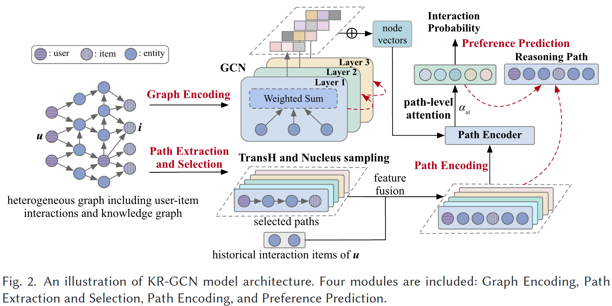

**Knowledge-Aware Reasoning with Graph Convolution Network for Explainable Recommendation**

# 1 引言
&emsp;&emsp;抽取并利用知识图谱(KG)中的多跳关系路径可以提高推荐系统的性能，并提供可解释性。然而，现有的工作仍面临着两个主要的挑战：用户偏好的错误传播和模型的弱解释性。提取并利用用户物品对之间的所有路径会引入不相关的路径，从而导致用户偏好的错误传播。尽管定义元路径在一定程度上可以缓解错误传播问题并提供一定的解释性，但模型的性能将严重依赖于预定义的元路径；最近一些基于GCN的模型在推荐任务上取得了较好的性能，但未能提供可解释性。为了解决上述问题，本文提出了KR-GCN，能够在提高推荐系统性能的同时，提供非预定义的DAG图形式的解释能力。
# 2 创新点
&emsp;&emsp;1.为了缓解错误传播问题，文章利用知识图谱表示方法计算三元组的打分，并采用核采样自适应地选择用户物品对之间的路径，以有效去除冗余信息。
&emsp;&emsp;2.为了提升推荐的性能并保证解释的多样性，文章将用户物品交互数据和知识图谱结合构成一个异构图，利用图卷积网络学习异构图的表示，然后采用路径级的注意力机制来区分不同路径的贡献并预测最终的交互概率，提升最终解释的相关性。
&emsp;&emsp;3.在三个数据集上进行实验，与基线模型相比，本文所提出的模型在性能上取得了一定的提升，同时，人工评估验证了KR-GCN 可信赖的解释能力。
# 3 具体实现
&emsp;&emsp;KR-GCN包括四个模块：图编码模块、路径抽取与选择模块、路径编码模块和偏好预测模块。图编码模块旨在学习异构图中的节点表示，路径抽取与选择模块旨在从异构图中抽取出用户和物品之间的路径并从中选择出高质量的推理路径，路径编码模块用于学习推理路径的表示，偏好预测模块则根据推理路径来预测用户的偏好。

模型整体框架如下：

•图编码

为了学习用户、物品和知识图谱中实体的表示，KR-GCN利用图表示模型GCN对包含用户物品交互数据和知识图谱的异构图进行编码。
$$\begin{array}{c}
e_{i}^{(l+1)}=\sigma\left(W_{\text {self }}^{(l)} e_{i}^{(l)}+\sum_{j \in N_{i}} \frac{1}{\left|N_{i}\right|} W^{(l)} e_{j}^{(l)}\right) \\
e_{i}=\sum_{l=0}^{L} \alpha_{l} e_{i}^{(l)}
\end{array}$$

•路径抽取与选择

本文在异构图上抽取用户物品对之间的多跳路径，用于获取用户的潜在兴趣的表示。然而考虑用户物品对之间的所有路径会涉及不相关的路径，导致错误传播问题。虽然定义元路径可以缓解错误传播的问题，但设计正确的元路径需要对特定领域的知识有深入的了解。为了解决错误传播和知识依赖问题，本文对用户物品对之间的不相关路径进行了修剪。对于用户物品对 (u, v)，本文找到u和v之间的路径集合  。由于用户物品对之间的路径数量随着路径跳数呈指数增长，因此本文在提取路径时对跳数进行限制。

考虑到在知识图谱中迭代每个用户物品对之间的所有路径效率低下，本文采用启发式的路径搜索算法进行路径抽取和选择。具体地，我们设计了一种基于特征转换的方法来为三元组打分，并利用核采样在用户物品对之间的路径中自适应地选择三元组，我们使用  和  表示路径搜索中的第k-1跳和第k跳中的节点集合。对于节点集合  中的节点  ，我们在图中搜索它的邻居作为节点  的下一跳节点，对于邻居节点，通过知识图谱表示方法计算对应三元组  的分数，其中  是第k-1和k跳之间的三元组。在本文中，三元组的分数通过TransH计算得出。

在计算了三元组  的得分后，我们采用核采样在每个用户物品对之间的路径中自适应地选择三元组，TransH和核采样被用于进行路径排序和选择，滤低质量路径，进而解决路径上的错误传播问题。核采样旨在自适应地对候选概率分布的 top-p部分进行采样，我们的目标是降低低质量路径的分数并对其进行过滤。三元组内的语义关联（即置信度）越高，三元组的得分越高，那么路径被选中的概率越大，也就是说，得分较高的三元组对路径选择的贡献更大。

在每一跳，三元组从累积概率超过阈值的最小可能的三元组中选择，其中累积概率是通过对三元组的概率分数求和来计算的，采样的三元组的数量可以根据概率分布动态增加或减少，为了进行核采样，三元组分数被归一化用来计算三元组的概率。
$$P\left(i_{k-1}, r_{k-1}, i_{k}\right)=\frac{\exp \left(f\left(e_{i}^{k-1}, e_{r}^{k-1}, e_{i}^{k}\right)\right)}{\sum_{\left(i^{\prime}{ }_{k-1}, r^{\prime}{ }_{k-1}, i^{\prime}{ }_{k}\right) \in T_{k-1, k} \exp \left(f\left(e_{i^{\prime}}^{k-1}, e_{r^{\prime}}^{k-1}, e_{i^{\prime}}^{k}\right)\right)}}$$
其中分数，由TransH计算得出。给定第 k-1跳和第 k跳之间三元组的概率分布，被选择的三元组被定义为满足以下条件的最小集合：
$$\sum_{\left(i_{k-1}, r_{k-1}, i_{k}\right) \in \operatorname{topp}\left(T_{k-1, k}\right)} P\left(i_{k-1}, r_{k-1}, i_{k}\right)>=p,$$
其中p是概率阈值。然后选择  中的三元组作为推理路径中的推理三元组，在每一跳，以与上述相同的方式选择三元组，最后形成推理路径集合  来反映用户u的潜在兴趣，减轻错误传播的影响。
•路径编码

虽然  已经包含了u和v之间的路径信息，但是这些路径主要是针对物品v的，不能反映用户u的其他兴趣，为了挖掘用户的更多兴趣，我们将用户的历史交互与选择路径的进行结合来捕获选择的路径和用户历史交互之间的相互影响。
KR-GCN 利用LSTM和注意力机制对选择的推理路径进行编码，该模块将图编码模块和路径抽取与选择模块的输出作为输入，图编码模块提供节点表示，路径提取和选择模块提供路径信息。由于路径中不同节点之间存在多跳关系信息和顺序依赖关系，因此该模块旨在捕获多跳关系信息并对每条路径内的顺序依赖关系进行编码。

•偏好预测

在推荐中，不同的路径通常对预测用户偏好的贡献不同，为了区分每个用户物品对之间不同路径对推理的不同贡献， KR-GCN采用了路径级的自注意力机制，学习每条路径上的路径权重，然后具有不同权重的多跳路径被聚合以表示用户的偏好。

