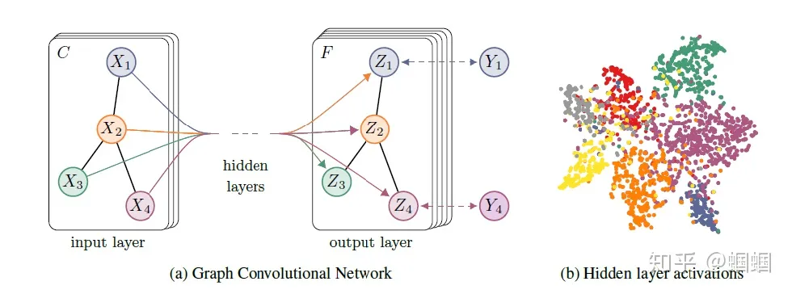

# 一.知识图谱
<font color=blue>论文来源：doi: 10.3778/j.issn.1673-9418.2302059</font>
## 1.1 信息抽取
信息抽取的关键在于从结构化和非结构化的数据中抽取出结构化的实体及关系信息
## 1.2 实体抽取
（1）基于规则的方法:
&emsp;&emsp;该方法的特点是在限定的语义和文本邻域的条件下进行，在定义好的规则抽取出实体信息，但是该方法大量依赖专家的经验，很难适应各种变化数据的新要求。
（2）基于统计学习的实体抽取方法:
&emsp;&emsp;将命名实体识别问题视为序列标注问题，使用部分标注或完全标注的语义信息进行训练
（3）基于深度学习的方法:
&emsp;&emsp;深度学习对于复杂非线性问题具有较好的拟合能力，能够学习到复杂的特征。
## 1.3 关系抽取
&emsp;&emsp;关系抽取经典的方法是基于依赖树的方法挖掘语义信息，关系抽取从抽取类型来看，可以分为基于句子级别的关系抽取和基于文档级别的关系抽取


# 二.GNN(图神经网络)
GNN 输入节点属性和邻接矩阵，输出隐藏节点表示，如  **$H = GNN(X, A) ∈ Rn×d$**

默认情况下，我们在节点分类任务中采用交叉熵损失函数，以最小化节点标签 Y 与获得的表示之间的差异，即 

&emsp;&emsp;&emsp;&emsp;&emsp;&emsp;&emsp;&emsp;**$L(H,Y)=-\sum_i{Y_i logsoftmax(H_i)}$**

## 2.1 GNN消息传递
GNN对属性向量优化的方法叫做消息传递机制，原理是基于节点邻居信息更新节点状态
### 2.1.1 聚合机制
邻居聚合是图神经网络中的基本操作之一，它通过将节点的邻居节点的信息聚合起来，以更新节点的表示。聚合方式可以是平均值、最大值、加权和等。,原始GNN使用的是SUM求和传递机制：
&emsp;&emsp;将邻居节点的特征进行加权求和，在加上自身特征，乘以原始参数，经过激活函数，就得到了新的节点特征。
示例：

<!-- (https://blog.csdn.net/qq_25601345/article/details/112135810) -->


# 三.GCN(图卷积神经网络)
## 3.1 理论研究
GCN网络模型图如图所示：


GCN的核心部分为：

&emsp;&emsp;假设我们手头有一批图数据，其中有N个节点（node），每个节点都有自己的特征，我们设这些节点的特征组成一个N×D维的矩阵X，然后各个节点之间的关系也会形成一个N×N维的矩阵A，也称为邻接矩阵（adjacency matrix）,X为特征矩阵。X和A便是我们模型的输入。

GCN也是一个神经网络层，它的层与层之间的传播方式是(聚合特征公式)：

<font size = 5>$H^{(h+1)}=\sigma(\widetilde{D}^{-\frac{1}{2}}\widetilde{A}\widetilde{D}^{-\frac{1}{2}}H^{(l)}W^{(l)})$</font>

这个公式中：

&emsp;&emsp;$\widetilde{A}=A+I，I$是单位矩阵

&emsp;&emsp;$\widetilde{D}是\widetilde{A}$的度矩阵（degree matrix），公式为 $\widetilde{D_{ii}} = \sum_{j}{A_{ij}}$

&emsp;&emsp;H是每一层的特征，对于输入层的话，H就是X

&emsp;&emsp;σ是非线性激活函数

## 3.2 存在问题
###3.2.1 问题一：过渡平滑
<!-- https://www.zhihu.com/question/346942899 -->


pytorch 已经封装好GCN卷积函数-->GCNConv,示例代码，假设就只是两层网络结构 
``` python
class Net(torch.nn.Module):
    def __init__(self):
        super(Net, self).__init__()
        self.conv1 = GCNConv(dataset.num_features, 16)  #输入=节点特征维度，16是中间隐藏神经元个数
        self.conv2 = GCNConv(16, dataset.num_classes)

        '''
            相当于两层网络模型
            第一层激活函数 reLU
            第二层激活函数 log_softmax 得到最终输出
        '''

    def forward(self, x, edge_index):
        x = self.conv1(x, edge_index)
        x = F.relu(x)
        x = self.conv2(x, edge_index)
        return F.log_softmax(x, dim=1)


