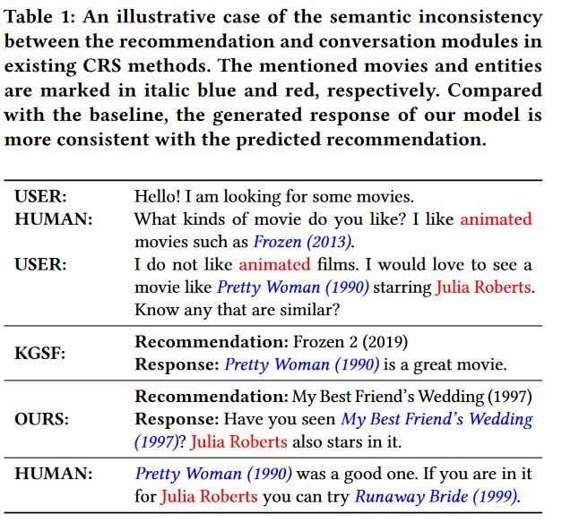
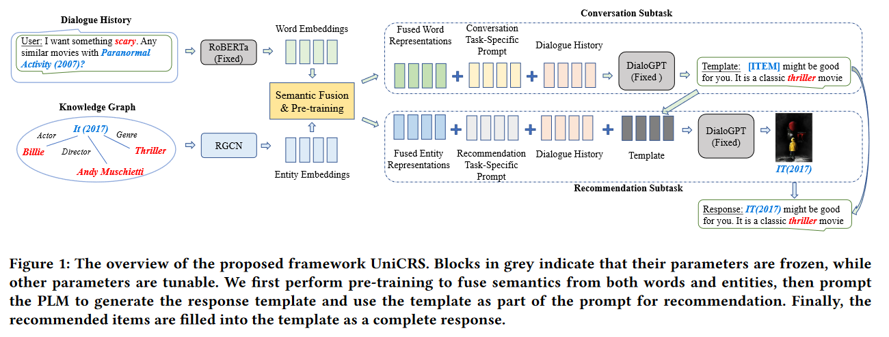

**Towards Unified Conversational Recommender Systems via Knowledge-Enhanced Prompt Learning**
# 引言
&emsp;&emsp;对话推荐系统（CRS）旨在通过自然语言对话为用户提供推荐服务。 一般来说，CRS 需要完成两个子任务：一个是推荐，根据对话从候选物品集合中选取物品推荐给用户；另一个是对话，根据对话历史生成相应的回复。 现有方法通常会设计推荐和对话这两个模块分别解决上述子任务。由于这两个子任务高度耦合，CRS 作为系统要能够无缝集成这两个模块。 为此，一类工作在模块之间共享知识（如知识图谱和评论）及其表示以增强模块间的语义交互，另一类工作通过设计表示对齐策略（如互信息最大化和对比学习）来增强模块间语义的一致性。

&emsp;尽管如此，推荐和对话模块之间语义不一致的问题仍然存在。 如图所示，对于基线模型 KGSF，尽管推荐模块预测了电影 Frozen 2 (2019) ，但对话模块似乎没有感知到这样的推荐结果，生成了包含另一部电影 Pretty Woman (1990) 的回复。

出现这种问题的原因主要有两个：

大多数方法采用不同的模型或技术来实现这两个模块，其中仅有部分参数或知识共享。
一个模块的结果不能被另一个模块感知和利用。例如，基线模型 KGSF 预测推荐结果时，无法利用生成的回复。
为了解决上述语义不一致的问题，本文想要以统一的方式实现推荐和对话模块。 本文注意到，预训练语言模型 (PLM) 可以有效地作为各种任务的通用解决方案，此外，最近提出的提示学习以简单而灵活的方式进一步统一了 PLM 在不同任务上的使用方式。 考虑到 CRS 中的推荐和对话子任务都是基于相同的输入（对话历史）进行预测，受到 PLM 及提示学习的启发，本文通过 PLM + 提示学习来建模推荐和对话模块，并提出了一个统一的对话式推荐模型 UniCRS。

# 方法简介
UniCRS 旨在通过提示学习帮助 PLM 更好地统一建模 CRS。 本文选取在大规模对话语料上进行预训练的 DialoGPT 作为本文的 PLM，并按照提示学习的范式固定其权重，通过在输入（对话文本）中加入提示来帮助 PLM 完成推荐和对话子任务。

# 提示学习中的语义融合
由于 DialoGPT 是在通用对话语料上进行预训练的，因此缺乏 CRS 所需要的领域知识，无法直接使用。 本文将知识图谱（KG）中的相关知识引入提示来弥补 DialoGPT 的不足。 然而，对话中的单词和 KG 中实体这两者所在的语义空间之间存在很大差异，使得 KG 上的知识不能有效地被 PLM 利用。 因此，本文首先需要对齐这两个语义空间。

# 编码对话中的单词和 KG 上的实体
给定对话历史 ，本文首先将其中出现的单词和实体分别进行编码。

对于单词，考虑到 DialoGPT 采用的是解码器的架构，在语言理解方面存在不足，本文采用了一个双向编码器 RoBERTa 来进行编码，得到单词的表示 
。
对于实体，本文首先将其链接到知识图谱 DBpedia，然后通过 R-GCN 编码抽取出的子图，得到实体的表示 